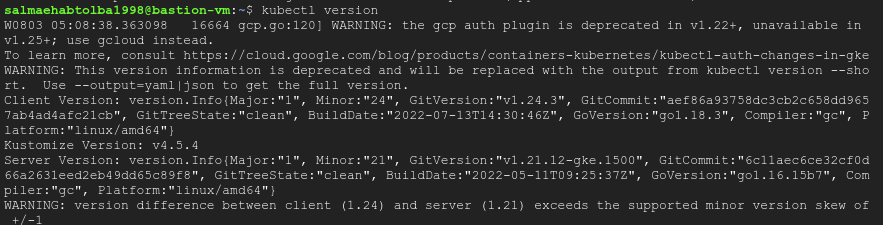

# Graduation-Project-ITI

## ssh vm instance

```bash
gcloud compute ssh bastion-vm --project salma-358017 --zone us-central1-a -- -L8888:127.0.0.1:8888
```

## Install kubctl



## then connect to the cluster (GKE)

```bash
gcloud container clusters get-credentials gke-cluster --zone us-central1-a --project salma-358017
```

### Install docker


### Install git


### Install gcloud


### Install open-jdk

To connect the slave in jenkins with cloud vm-instance 


### Build docker image for Jenkins


### Create namespace then deploy Jenkins

```bash
kubectl create namespace jenkins-ns1
kubectl config set-context --current –namespace=jenkins-ns1
kubectl create -f deployment.yaml
kubectl create -f serviceLB.yaml
```


**Jenkins link : [http://35.202.111.14:8080](http://35.202.111.14:8080/)**


## create credentials for dockerhub


## Create credentials for slave

Generate key in cloud vm-instane , put the public key in the authorized_keys file and the private on in the credential configurations

-username of instance to ssh


-private key generated from ssh-keygen


Here the credentials created


## Let’s create slave


## Build pipeline that pull docker file from git then build the image of the application then push it to dockerhub then deploy the application


Image pushed successfully

**Pipline automated successfully**

## Get IP:Port for the application


## OR


# Finallyyyyyy

## App link: [http://34.68.90.32:3000/](http://34.68.90.32:3000/)

